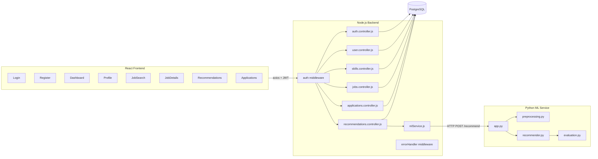
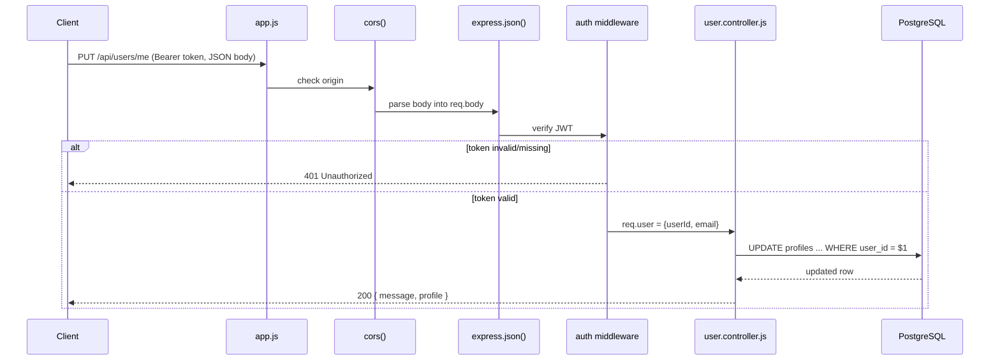
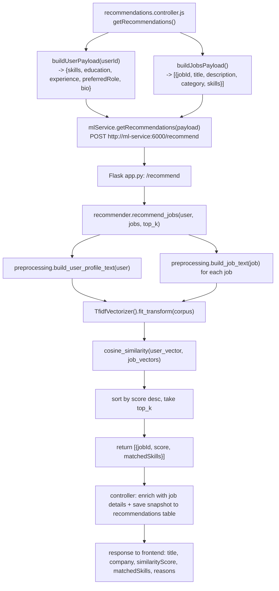

# Low-Level Design (LLD)

## 1. Module-Level Breakdown



## 2. Request Lifecycle — Protected Endpoint Example

Example: `PUT /api/users/me`



## 3. Recommendation Pipeline — Class/Function-Level Detail



## 4. Key Data Structures

**Payload sent from Node.js → Python ML service:**
```json
{
  "user": {
    "userId": 12,
    "skills": ["Python", "SQL", "Git"],
    "education": "B.Tech Computer Science",
    "experience": 1.5,
    "preferredRole": "Backend Developer",
    "bio": "Backend developer who enjoys building REST APIs."
  },
  "jobs": [
    {
      "jobId": 1,
      "title": "Backend Developer",
      "company": "TechNova Pvt Ltd",
      "description": "We are looking for a Python Backend Developer...",
      "category": "Backend",
      "skills": ["Python", "SQL", "REST API", "Docker"]
    }
  ],
  "topK": 5
}
```

**Response from Python ML service → Node.js:**
```json
{
  "recommendations": [
    { "jobId": 1, "score": 0.7891, "matchedSkills": ["Python", "SQL"] }
  ]
}
```

## 5. Error Handling Strategy

- Every async controller is wrapped in `asyncHandler()` so a thrown/rejected
  error is forwarded to Express's error-handling middleware (`next(err)`)
  instead of crashing the process.
- `errorHandler.js` is the single place that decides the HTTP status code and
  JSON error shape returned to the client (`{ error: "message" }`).
- If the ML service is unreachable, `mlService.js`'s `fetch` call throws, which
  bubbles up through `asyncHandler` to `errorHandler`, returning a `500` with a
  message like `ML service error (...)` — this is also the answer to the
  interview question *"what happens if the ML service goes down?"*.

## 6. Security Design Decisions

| Concern                        | Mitigation                                                        |
|----------------------------------|---------------------------------------------------------------------|
| Plain-text passwords             | bcrypt hash with salt (10 rounds) before storage                    |
| Unauthorized API access          | JWT required via `Authorization: Bearer <token>` + auth middleware  |
| Duplicate applications           | `UNIQUE(user_id, job_id)` DB constraint + application-level check   |
| SQL injection                    | All queries use parameterized `$1, $2...` placeholders (`pg` library), never string concatenation |
| Leaking which emails are registered | Login returns the same error for "no such user" and "wrong password" |
| Hardcoded secrets                | All secrets (DB password, JWT secret) come from environment variables, never committed to code |
| Cross-origin requests            | `cors()` middleware explicitly enabled on the backend               |
