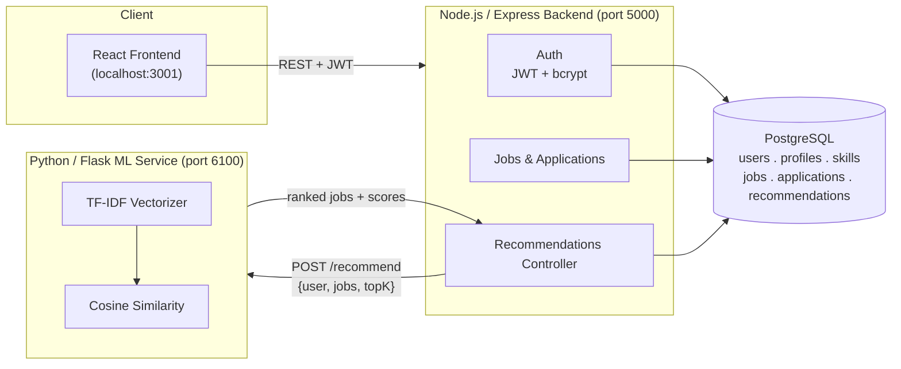

# 🎯 Personalized Job Recommendation Platform

A full-stack web platform that recommends jobs to users based on their skills, education, and preferences — using a **content-based ML recommendation engine** (TF-IDF + Cosine Similarity) served from a dedicated Python microservice.

> Built as a 4-service architecture: **React** frontend, **Node.js/Express** API, **Python/Flask** ML microservice, and **PostgreSQL** database — all orchestrated with Docker Compose.

---

## 📌 Table of Contents

- [Why This Project](#-why-this-project)
- [How It Works](#-how-it-works)
- [Architecture](#-architecture)
- [Tech Stack](#-tech-stack)
- [The Recommendation Engine, Explained](#-the-recommendation-engine-explained)
- [Getting Started](#-getting-started)
- [API Reference](#-api-reference)
- [Project Structure](#-project-structure)
- [Roadmap](#-roadmap)
- [Known Limitations](#-known-limitations)

---

## 💡 Why This Project

Job boards usually make users do all the filtering work themselves. This platform flips that: a user builds a lightweight profile (skills, education, preferred role, bio) once, and the system **ranks every open job by how well it matches them** — with a plain-English explanation of *why* each job was recommended, not just a score.

---

## ⚙️ How It Works

In one sentence: **a user's profile and every job posting are converted into text, turned into weighted word vectors (TF-IDF), and compared using cosine similarity — the closer two vectors point in the same direction, the better the match.**

Step by step, when a logged-in user opens their **Recommendations** page:

1. The **frontend** (React) calls `GET /api/recommendations?topK=5`.
2. The **backend** (Node/Express) pulls the user's profile + skills, and every job + its required skills, from **PostgreSQL**.
3. The backend forwards this bundle to the **ML microservice** (Python/Flask) over HTTP.
4. The ML service builds a "profile text" for the user and a "job text" for every job, vectorizes all of them together with **TF-IDF**, and scores each job against the user with **cosine similarity**.
5. The top-K jobs (by score) are sent back to the backend, which enriches them with job details, saves a snapshot to the `recommendations` table (for later explainability/evaluation), and returns the ranked list.
6. The frontend renders each job with a **similarity bar**, matched skills, and human-readable reasons ("Skills matched: Python, SQL").

---

## 🏗 Architecture



**Why a separate ML microservice instead of doing this in Node?**
scikit-learn (TF-IDF, cosine similarity) is a mature Python ecosystem tool with no equivalent-quality library in Node. Splitting it out also means the ML logic can be redeployed, scaled, or swapped (e.g. for a smarter model later) independently of the main API.

> ⚠️ **Port note:** the ML service runs on **6100**, not 6000. Port 6000 is on the [Fetch spec's blocked-ports list](https://fetch.spec.whatwg.org/#port-blocking) (reserved for X11), so Node's built-in `fetch` refuses to connect to it. This was an early bug in the project — see [Known Limitations](#-known-limitations).

---

## 🧰 Tech Stack

| Layer | Technology | Purpose |
|---|---|---|
| Frontend | React 18, React Router, Axios | UI, routing, API calls |
| Backend | Node.js, Express | REST API, auth, business logic |
| Auth | JWT, bcrypt | Stateless auth, password hashing |
| ML Service | Python, Flask | Recommendation scoring API |
| ML Core | scikit-learn (TF-IDF, cosine similarity), pandas, numpy | Text vectorization & similarity scoring |
| Database | PostgreSQL 16 | Relational storage |
| Infra | Docker, Docker Compose | Local orchestration of all 4 services |
| Testing | Jest, Supertest | Backend integration tests |

---

## 🧠 The Recommendation Engine, Explained

This is a **content-based, unsupervised** recommender — no labeled training data ("user X liked job Y") is needed.

**1. Build text profiles**
- *User text* = skills (repeated twice for extra weight) + preferred role + education + bio
- *Job text* = title (repeated twice) + required skills + category + description

**2. Clean the text** (`preprocessing.py`)
Lowercase → strip punctuation (keeping `+`/`#` for "C++", "C#") → remove stopwords → tokenize.

**3. Vectorize with TF-IDF**
All texts (1 user + N jobs) are fit into a single TF-IDF vector space together, so they share the same vocabulary. Each word's weight reflects how *distinctive* it is — common words like "developer" get down-weighted, rare/specific words like "Kubernetes" get up-weighted.

**4. Score with Cosine Similarity**
The user's vector is compared to every job's vector. The result is a score from **0 (unrelated) to 1 (near-identical)**.

**5. Rank & explain**
Jobs are sorted by score, the top-K returned, and each is annotated with which of the user's skills actually appear in that job's required skills — this is what powers the "Skills matched: Python, SQL" explanation on the frontend.

**Why this approach over a deep learning model?** It's explainable (every score traces back to real words), needs no training data, and is fast even with a small job catalog — deep learning models need much more data to beat a well-tuned TF-IDF baseline at this scale.

---

## 🚀 Getting Started

### Option A — Docker Compose (recommended)

```bash
git clone <your-repo-url>
cd job-recommendation-platform
docker compose up --build
```

| Service | URL |
|---|---|
| Frontend | http://localhost:3001 |
| Backend API | http://localhost:5050/api |
| ML Service | http://localhost:6100 |
| PostgreSQL | localhost:5433 |

### Option B — Run services manually

```bash
# 1. Database
createdb job_recommendation_db
psql -d job_recommendation_db -f database/schema.sql
psql -d job_recommendation_db -f database/seed.sql

# 2. ML service
cd ml-service
pip install -r requirements.txt
python app.py          # runs on :6100

# 3. Backend
cd backend
cp .env.example .env   # fill in DB creds
npm install
npm run dev             # runs on :5000

# 4. Frontend
cd frontend
cp .env.example .env
npm install
npm start                # runs on :3000
```

### Quick smoke test (curl)

```bash
# Register
curl -s -X POST http://localhost:5050/api/auth/register \
  -H "Content-Type: application/json" \
  -d '{"email":"you@example.com","password":"password123","fullName":"Your Name"}'

# Add a skill (replace $TOKEN with the token from register/login)
curl -s -X POST http://localhost:5050/api/users/skills \
  -H "Content-Type: application/json" -H "Authorization: Bearer $TOKEN" \
  -d '{"skillName":"Python"}'

# Get recommendations
curl -s "http://localhost:5050/api/recommendations?topK=5" \
  -H "Authorization: Bearer $TOKEN"
```

---

## 📡 API Reference

All protected routes require `Authorization: Bearer <JWT>`.

| Method | Endpoint | Auth | Description |
|---|---|:---:|---|
| POST | `/api/auth/register` | ❌ | Create account, returns JWT |
| POST | `/api/auth/login` | ❌ | Login, returns JWT |
| GET | `/api/users/me` | ✅ | Get profile + skills |
| PUT | `/api/users/me` | ✅ | Update profile fields |
| GET | `/api/skills` | ❌ | List master skills |
| POST | `/api/users/skills` | ✅ | Add a skill to your profile |
| DELETE | `/api/users/skills/:skillId` | ✅ | Remove a skill |
| GET | `/api/jobs` | ❌ | Search jobs (`skill`, `title`, `location`, `minExperience`, `page`, `limit`, `sort`) |
| GET | `/api/jobs/:id` | ❌ | Job details + required skills |
| POST | `/api/jobs` | — | Create a job (admin) |
| PUT | `/api/jobs/:id` | — | Update a job (admin) |
| DELETE | `/api/jobs/:id` | — | Delete a job (admin) |
| POST | `/api/jobs/:id/apply` | ✅ | Apply to a job |
| GET | `/api/applications` | ✅ | List your applications |
| PUT | `/api/applications/:id` | ✅ | Update application status (recruiter) |
| GET | `/api/recommendations?topK=5` | ✅ | Get ranked job recommendations |
| GET | `/api/recommendations/:jobId` | ✅ | Explain why one job matches you |

---

## 📁 Project Structure

```
job-recommendation-platform/
├── frontend/            # React app (Login, Register, Dashboard, JobSearch, JobDetails, Applications, Recommendations)
├── backend/              # Express API (auth, jobs, applications, recommendations, skills)
│   └── src/
│       ├── controllers/  # Business logic per resource
│       ├── routes/       # Route definitions
│       ├── middleware/   # auth, error handling
│       └── services/     # mlService.js — the only file that talks to the ML microservice
├── ml-service/           # Flask app: preprocessing → TF-IDF → cosine similarity
├── database/             # schema.sql + seed.sql
└── docker-compose.yml    # Wires all 4 services together
```

---

## 🗺 Roadmap

See [`ROADMAP.md`](./ROADMAP.md) for the full phased plan with priorities.

**Quick view:**

| Phase | Focus | Status |
|---|---|---|
| 0 | Core platform (auth, jobs, applications, TF-IDF recommendations) | ✅ Done |
| 1 | Hardening (ownership checks, dedup, rate limiting, validation) | 🔜 Next |
| 2 | Smarter recommendations (weighted skills, experience matching, feedback loop) | 📋 Planned |
| 3 | Recruiter-side features (job posting UI, applicant tracking, roles) | 📋 Planned |
| 4 | Production readiness (CI/CD, monitoring, deployment) | 📋 Planned |

---

## ⚠️ Known Limitations

- **`PUT /api/applications/:id`** currently has no ownership/role check — any authenticated user can update any application's status. There's no recruiter role yet in the schema.
- **`recommendations` table grows unbounded** — every call to `GET /api/recommendations` inserts new rows with no dedup or cleanup.
- **Historical bug (fixed):** the ML service originally ran on port `6000`, which Node's `fetch` refuses to connect to (it's on the Fetch spec's blocked-ports list). Moved to `6100`.
- No password reset / email verification flow yet.
- No rate limiting on auth endpoints.

---

## 📄 License

Internal / educational project — add a license here if open-sourcing.
# Job_Recommendation-Platform
