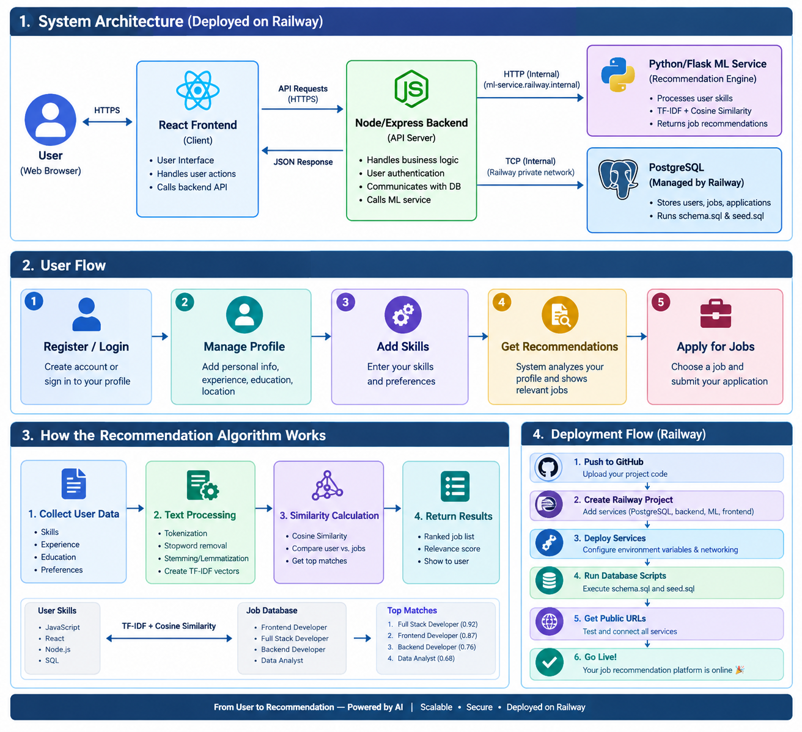

# Personalized Job Recommendation Platform

A full-stack web platform that recommends jobs to users based on their skills, education, and preferences — using a **content-based ML recommendation engine** (TF-IDF + Cosine Similarity) served from a dedicated Python microservice.

> Built as a 4-service architecture: **React** frontend, **Node.js/Express** API, **Python/Flask** ML microservice, and **PostgreSQL** database — all orchestrated with Docker Compose.

## System Overview



The diagram above shows the complete system architecture, the end-to-end user flow, how the recommendation algorithm scores jobs, and the deployment flow.

---

## Table of Contents

- [Why This Project](#why-this-project)
- [How It Works](#how-it-works)
- [Architecture](#architecture)
- [Tech Stack](#tech-stack)
- [The Recommendation Engine, Explained](#the-recommendation-engine-explained)
- [Recommendation Evaluation](#recommendation-evaluation)
- [Getting Started](#getting-started)
- [Full Curl Walkthrough](#full-curl-walkthrough)
- [Expected Error Responses](#expected-error-responses)
- [API Reference](#api-reference)
- [Project Structure](#project-structure)
- [Deployment](#deployment)
- [Roadmap](#roadmap)
- [Known Limitations](#known-limitations)
- [Author](#author)
- [License](#license)

---

## Why This Project

Job boards usually make users do all the filtering work themselves. This platform flips that: a user builds a lightweight profile (skills, education, preferred role, bio) once, and the system **ranks every open job by how well it matches them** — with a plain-English explanation of *why* each job was recommended, not just a score.

---

## How It Works

In one sentence: **a user's profile and every job posting are converted into text, turned into weighted word vectors (TF-IDF), and compared using cosine similarity — the closer two vectors point in the same direction, the better the match.**

Step by step, when a logged-in user opens their **Recommendations** page:

1. The **frontend** (React) calls `GET /api/recommendations?topK=5`.
2. The **backend** (Node/Express) pulls the user's profile + skills, and every job + its required skills, from **PostgreSQL**.
3. The backend forwards this bundle to the **ML microservice** (Python/Flask) over HTTP.
4. The ML service builds a "profile text" for the user and a "job text" for every job, vectorizes all of them together with **TF-IDF**, and scores each job against the user with **cosine similarity**.
5. The top-K jobs (by score) are sent back to the backend, which enriches them with job details, saves a snapshot to the `recommendations` table (for later explainability/evaluation), and returns the ranked list.
6. The frontend renders each job with a **similarity bar**, matched skills, and human-readable reasons ("Skills matched: Python, SQL").

---

## Architecture


| Service | Technology | Responsibility |
|---|---|---|
| Frontend | React | User interface |
| Backend | Node.js, Express.js | Authentication, users, jobs, and APIs |
| Database | PostgreSQL | Persistent application data |
| ML Service | Python, Flask, Scikit-learn | Recommendation generation |

### Why a separate ML microservice instead of doing this in Node?

scikit-learn (TF-IDF, cosine similarity) is a mature Python ecosystem tool with no equivalent-quality library in Node. Splitting it out also means the ML logic can be redeployed, scaled, or swapped (e.g. for a smarter model later) independently of the main API.

> **Port note:** the ML service runs on **6100**, not 6000. Port 6000 is on the [Fetch spec's blocked-ports list](https://fetch.spec.whatwg.org/#port-blocking) (reserved for X11), so Node's built-in `fetch` refuses to connect to it. This was an early bug in the project — see [Known Limitations](#known-limitations).

---

## Tech Stack

| Layer | Technology | Purpose |
|---|---|---|
| Frontend | React 18, React Router, Axios | UI, routing, API calls |
| Backend | Node.js, Express | REST API, auth, business logic |
| Auth | JWT, bcrypt | Stateless auth, password hashing |
| ML Service | Python, Flask | Recommendation scoring API |
| ML Core | scikit-learn (TF-IDF, cosine similarity), pandas, numpy | Text vectorization & similarity scoring |
| Database | PostgreSQL 16 | Relational storage |
| Infra | Docker, Docker Compose | Local orchestration of all 4 services |
| Testing | Jest, Supertest | Backend integration tests |

---

## The Recommendation Engine, Explained

This is a **content-based, unsupervised** recommender — no labeled training data ("user X liked job Y") is needed.

### 1. Build text profiles

- **User text** = skills (repeated twice for extra weight) + preferred role + education + bio
- **Job text** = title (repeated twice) + required skills + category + description

### 2. Clean the text

`preprocessing.py` performs:

```text
Lowercase
   ↓
Strip punctuation
   ↓
Keep + / # for C++ and C#
   ↓
Remove stopwords
   ↓
Tokenize
```

### 3. Vectorize with TF-IDF

All texts (1 user + N jobs) are fit into a single TF-IDF vector space together, so they share the same vocabulary.

Each word's weight reflects how **distinctive** it is — common words like "developer" get down-weighted, while rare/specific words like "Kubernetes" get up-weighted.

### 4. Score with Cosine Similarity

The user's vector is compared to every job's vector. The result is a score from **0 (unrelated) to 1 (near-identical)**.

### 5. Rank & explain

Jobs are sorted by score, the top-K returned, and each is annotated with which of the user's skills actually appear in the job's required skills.

This powers the frontend explanation:

> Skills matched: Python, SQL

### Why this approach over a deep learning model?

It's explainable (every score traces back to real words), needs no training data, and is fast even with a small job catalog — deep learning models need much more data to beat a well-tuned TF-IDF baseline at this scale.

### Example Recommendation

For a Python/Backend-focused user, the recommendation system can produce results such as:

| Rank | Job | Similarity | Matched Skills |
|---|---|---|---|
| 1 | Backend Developer | 0.53 | Python, SQL |
| 2 | Junior Python Developer | 0.45 | Python, SQL |
| 3 | Java Backend Engineer | 0.23 | SQL |
| 4 | Data Analyst | 0.20 | Python, SQL |
| 5 | Node.js Developer | 0.16 | None |

The frontend displays both the similarity score and the matched skills to make each recommendation explainable.

---

## Recommendation Evaluation

The recommendation system was evaluated with an automated Python experiment, implemented in [`ml-service/run_experiments.py`](./ml-service/run_experiments.py).

**Evaluation dataset:** 3 test users, 10 job postings, K = 5, with manually labeled ground truth.

Three approaches were compared:

| Version | Approach | Precision@5 | Recall@5 |
|---|---|---|---|
| V1 | Keyword Matching | 53.33% | 91.67% |
| V2 | TF-IDF + Cosine Similarity — Lean Profile (skills + preferred role) | **60.00%** | **100.00%** |
| V3 | TF-IDF + Cosine Similarity — Full Profile (skills + role + education + bio) | 53.33% | 91.67% |

**V1 → V2 improvement:**

- Precision@5: 53.33% → 60.00% (+6.67 pp, 12.51% relative)
- Recall@5: 91.67% → 100.00% (+8.33 pp, 9.09% relative)

The **lean-profile TF-IDF configuration (V2)** performed best. Adding education and bio to the profile text (V3) did *not* improve results on this dataset — a useful illustration of why feature selection matters when building a content-based profile.

Run it yourself:

```bash
cd ml-service
python3 run_experiments.py
```

Example output:

```text
======================================================================
AVERAGE METRICS ACROSS ALL TEST USERS (K=5)
======================================================================
Version                       Precision@5    Recall@5
V1 - Keyword Matching         0.5333         0.9167
V2 - TF-IDF (lean profile)    0.6000         1.0000
V3 - TF-IDF (full profile)    0.5333         0.9167

======================================================================
IMPROVEMENT: V1 -> V2
======================================================================
Precision@5: 0.5333 -> 0.6
Absolute improvement: 0.0667
Relative improvement: 12.51%

Recall@5:    0.9167 -> 1.0
Absolute improvement: 0.0833
Relative improvement: 9.09%
```

> **Evaluation limitation:** this is intentionally a small offline benchmark — 3 manually labeled user profiles and 10 job postings. These results demonstrate the relative behavior of the three approaches on this test set and should **not** be interpreted as a production-scale accuracy measurement. A larger set of real user profiles, job postings, and relevance judgments would give a more statistically meaningful evaluation.

---

## Getting Started

### Option A — Docker Compose (recommended)

```bash
git clone https://github.com/Kumar9113/Job_Recommendation-Platform.git

cd Job_Recommendation-Platform

docker compose up --build
```

| Service | URL |
|---|---|
| Frontend | http://localhost:3001 |
| Backend API | http://localhost:5050/api |
| ML Service | http://localhost:6100 |
| PostgreSQL | localhost:5433 |

### Option B — Run services manually

```bash
# 1. Database
createdb job_recommendation_db
psql -d job_recommendation_db -f database/schema.sql
psql -d job_recommendation_db -f database/seed.sql

# 2. ML service
cd ml-service
pip install -r requirements.txt
python app.py          # runs on :6100

# 3. Backend
cd backend
cp .env.example .env   # fill in DB creds
npm install
npm run dev             # runs on :5000

# 4. Frontend
cd frontend
cp .env.example .env
npm install
npm start                # runs on :3000
```

---

## Full Curl Walkthrough

All commands below assume **Docker Compose** (backend on `5050`). If you're running the backend manually instead, swap `5050` for `5000`.

Every protected endpoint needs `Authorization: Bearer <JWT>`.

### Save the token

```bash
TOKEN=$(curl -s -X POST http://localhost:5050/api/auth/login \
  -H "Content-Type: application/json" \
  -d '{"email":"you@example.com","password":"password123"}' \
  | python3 -c "import sys,json; print(json.load(sys.stdin)['token'])")

echo $TOKEN
```

### 1. Register a new user

```bash
curl -s -X POST http://localhost:5050/api/auth/register \
  -H "Content-Type: application/json" \
  -d '{"email":"you@example.com","password":"password123","fullName":"Your Name"}'
```

### 2. Log in

```bash
curl -s -X POST http://localhost:5050/api/auth/login \
  -H "Content-Type: application/json" \
  -d '{"email":"you@example.com","password":"password123"}'
```

### 3. Get your profile

```bash
curl -s http://localhost:5050/api/users/me \
  -H "Authorization: Bearer $TOKEN"
```

### 4. Update your profile

```bash
curl -s -X PUT http://localhost:5050/api/users/me \
  -H "Content-Type: application/json" \
  -H "Authorization: Bearer $TOKEN" \
  -d '{"education":"BTech","experienceYears":1.5,"preferredRole":"Backend Developer","location":"Hyderabad","bio":"Backend developer who loves Python and SQL."}'
```

### 5. List master skills

```bash
curl -s http://localhost:5050/api/skills
```

### 6. Add skills

```bash
curl -s -X POST http://localhost:5050/api/users/skills \
  -H "Content-Type: application/json" \
  -H "Authorization: Bearer $TOKEN" \
  -d '{"skillName":"Python"}'

curl -s -X POST http://localhost:5050/api/users/skills \
  -H "Content-Type: application/json" \
  -H "Authorization: Bearer $TOKEN" \
  -d '{"skillName":"SQL"}'
```

### 7. Remove a skill

Replace `:skillId` with the `skillId` returned from the add-skill request.

```bash
curl -s -X DELETE http://localhost:5050/api/users/skills/1 \
  -H "Authorization: Bearer $TOKEN"
```

### 8. Search / browse jobs

```bash
curl -s "http://localhost:5050/api/jobs?limit=5"
```

With filters:

```bash
curl -s "http://localhost:5050/api/jobs?skill=Python&location=Hyderabad&minExperience=0&page=1&limit=5"
```

### 9. Get one job's details

```bash
curl -s http://localhost:5050/api/jobs/1
```

### 10. Get ranked recommendations

```bash
curl -s "http://localhost:5050/api/recommendations?topK=5" \
  -H "Authorization: Bearer $TOKEN"
```

### 11. Explain why one job matches you

```bash
curl -s http://localhost:5050/api/recommendations/1 \
  -H "Authorization: Bearer $TOKEN"
```

### 12. Apply to a job

```bash
curl -s -X POST http://localhost:5050/api/jobs/1/apply \
  -H "Authorization: Bearer $TOKEN"
```

### 13. List your applications

```bash
curl -s http://localhost:5050/api/applications \
  -H "Authorization: Bearer $TOKEN"
```

### 14. Update an application's status

Replace `1` with the application ID from step 13.

```bash
curl -s -X PUT http://localhost:5050/api/applications/1 \
  -H "Content-Type: application/json" \
  -H "Authorization: Bearer $TOKEN" \
  -d '{"status":"shortlisted"}'
```

Valid `status` values:

```text
applied
shortlisted
rejected
hired
```

Check `applications.controller.js` if this list has changed.

---

## Expected Error Responses

| Scenario | Status |
|---|---|
| Register with an email already in use | `409 Conflict` |
| Register with password under 6 chars | `400 Bad Request` |
| Login with wrong password | `401 Unauthorized` |
| Any protected route with no/invalid token | `401 Unauthorized` |
| Apply to a job twice | `409 Conflict` |
| Apply to a non-existent job id | `404 Not Found` |
| Update application status to an invalid value | `400 Bad Request` |

---

## API Reference

All protected routes require `Authorization: Bearer <JWT>`.

| Method | Endpoint | Auth | Description |
|---|---|:---:|---|
| POST | `/api/auth/register` | No | Create account, returns JWT |
| POST | `/api/auth/login` | No | Login, returns JWT |
| GET | `/api/users/me` | Yes | Get profile + skills |
| PUT | `/api/users/me` | Yes | Update profile fields |
| GET | `/api/skills` | No | List master skills |
| POST | `/api/users/skills` | Yes | Add a skill to your profile |
| DELETE | `/api/users/skills/:skillId` | Yes | Remove a skill |
| GET | `/api/jobs` | No | Search jobs (`skill`, `title`, `location`, `minExperience`, `page`, `limit`, `sort`) |
| GET | `/api/jobs/:id` | No | Job details + required skills |
| POST | `/api/jobs` | Admin | Create a job |
| PUT | `/api/jobs/:id` | Admin | Update a job |
| DELETE | `/api/jobs/:id` | Admin | Delete a job |
| POST | `/api/jobs/:id/apply` | Yes | Apply to a job |
| GET | `/api/applications` | Yes | List your applications |
| PUT | `/api/applications/:id` | Yes | Update application status (recruiter) |
| GET | `/api/recommendations?topK=5` | Yes | Get ranked job recommendations |
| GET | `/api/recommendations/:jobId` | Yes | Explain why one job matches you |

The ML service also exposes a simple health check:

```
GET /health
```

```json
{
  "service": "ml-service",
  "status": "ok"
}
```

---

## Project Structure

```text
job-recommendation-platform/

├── FlowGraph.png
├── frontend/
│   └── React app
│       ├── Login
│       ├── Register
│       ├── Dashboard
│       ├── JobSearch
│       ├── JobDetails
│       ├── Applications
│       └── Recommendations
│
├── backend/
│   └── Express API
│       └── src/
│           ├── controllers/
│           ├── routes/
│           ├── middleware/
│           └── services/
│               └── mlService.js
│
├── ml-service/
│   └── Flask app
│       ├── preprocessing.py
│       ├── recommender.py
│       ├── evaluation.py
│       └── run_experiments.py
│
├── database/
│   ├── schema.sql
│   └── seed.sql
│
└── docker-compose.yml
```

---

## Deployment

The four services (frontend, backend, ML service, PostgreSQL) are designed to be deployed independently. Two deployment paths are provided in this repo:

- **`render.yaml`** — a Render Blueprint that deploys the Flask ML service, Node/Express backend, and their environment variables as separate managed web services.
- **[`DEPLOYMENT.md`](./DEPLOYMENT.md)** — a step-by-step guide to self-hosting all four services on a single VPS (DigitalOcean, Linode, AWS Lightsail, Hetzner, etc.) using the same `docker-compose.yml` you test with locally, plus notes on the required production changes (JWT secret, DB password, `REACT_APP_API_URL`, CORS, DB SSL).

The system diagram at the top of this README illustrates the same request flow regardless of which platform each service ends up on.

---

## Roadmap

See [`ROADMAP.md`](./ROADMAP.md) for the full phased plan with priorities.

### Quick view

| Phase | Focus | Status |
|---|---|---|
| 0 | Core platform (auth, jobs, applications, TF-IDF recommendations) | Done |
| 1 | Hardening (ownership checks, dedup, rate limiting, validation) | Next |
| 2 | Smarter recommendations (weighted skills, experience matching, feedback loop) | Planned |
| 3 | Recruiter-side features (job posting UI, applicant tracking, roles) | Planned |
| 4 | Production readiness (CI/CD, monitoring, deployment) | Planned |

### Future Improvements

- Expand the evaluation dataset beyond 3 manually labeled profiles
- Evaluate against a larger set of job postings
- Collect real user interaction data such as clicks, saves, and applications
- Introduce hybrid collaborative + content-based recommendation
- Tune TF-IDF parameters using a larger validation dataset
- Add recommendation diversity and freshness
- Automate larger-scale evaluation pipelines
- Monitor recommendation quality over time

---

## Known Limitations

- **`PUT /api/applications/:id`** currently has no ownership/role check — any authenticated user can update any application's status. There's no recruiter role yet in the schema.
- **`recommendations` table grows unbounded** — every call to `GET /api/recommendations` inserts new rows with no dedup or cleanup.
- **Historical bug (fixed):** the ML service originally ran on port `6000`, which Node's `fetch` refuses to connect to (it's on the Fetch spec's blocked-ports list). Moved to `6100`.
- No password reset / email verification flow yet.
- No rate limiting on auth endpoints.
- The current evaluation benchmark (3 users, 10 jobs) is small and offline — see [Recommendation Evaluation](#recommendation-evaluation) for details.

---

## Author

**Kumar Gogula**
M.Tech, Computer Science & Engineering — IIT Hyderabad
GitHub: [Kumar9113](https://github.com/Kumar9113)

---

## License

This project is intended for educational, research, and portfolio purposes. Add a formal license here if open-sourcing.